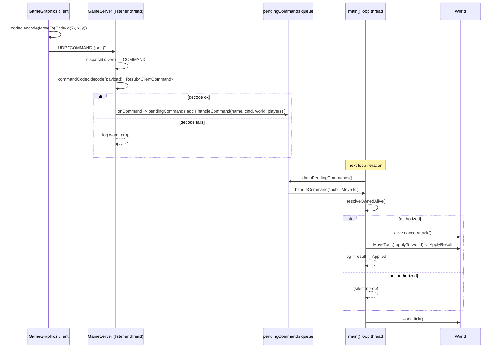

# Plan: adopt GameTools 5.0.0's `ClientCommand` protocol

> The filename predates the 2026-09-07 re-scope (it began as a snapshot-id-addressing plan).
> It is kept in place because **SpartanLabsGaming/MyGameServer#6's body links to
> `docs/plan-snapshot-id-addressing.md`** — renaming it would break that link.

## Header

- **Covers:** `SpartanLabsGaming/MyGameServer#6` — *"Address client commands by stable entity
  id (GameTools 3.1.0)"*, re-scoped 2026-09-07 to: replace the interim hand-rolled text
  command verbs with GameTools 5.0.0's first-class `ClientCommand` / `ClientCommandCodec` /
  `ClientCommand.applyTo` API (upstream MyGameTools#31, shipped in 5.0.0).
- **Branch:** `feature/issue-6-client-command-protocol` (cut from latest `master`)
- **Commit:** TBD — this plan document is committed **in the same commit as the first stage
  of the implementation** so `git log --follow` binds the two.
- **PR:** TBD — squash-merge, `Closes #6` in the body (repo convention).
- **What this plans:** the MyGameServer-side migration only. The GameGraphics client change
  is a separate, lockstep repo (GameGraphics#1) — this plan names the coordination but does
  not design it.
- **Status:** as-built record moved to [final-implementation.md](final-implementation.md).
- **Target version:** MyGameServer `1.0.0` → `2.0.0` (the client-command wire form is fully
  replaced).
- **Related docs:** `docs/plans/7-simulation-loop/plan.md` (do this plan first — both edit
  `Main.kt`); issue MyGameTools#39 (upstream ask: `applyTo` should call off a pending attack
  on a movement command); GameGraphics#1 (matching client).

---

## 1. Context

### 1.1 What already shipped (on `master`, deployed)

PR #8 (`ee579e1`) + PR #9 (`afc5cd4`) landed an **interim** entity-id command protocol:

- `Main.kt::handleClientMessage` (`src/main/kotlin/Main.kt:95`) parses whitespace-delimited
  text verbs: `PING`, `SET_DEST <id> <x> <y>`, `ATTACK <atkId> <tgtId>`, `STOP <id>`.
  Operands are `EntityId.raw` longs, resolved with `world.byId(EntityId(id))`.
- `SET_SPEED` was deleted (unauthorized demo hook, no client feature depended on it).
- Authorization lives in `Main.kt`: `resolveOwnedAlive` (`src/main/kotlin/Main.kt:153`) and
  `issuePlayerAttack` (`src/main/kotlin/Main.kt:181`). Covered by `AttackCommandTest` (9) and
  `SetDestCommandTest` (7); plus `CommandQueueTest` (2) and `PlayerRosterTest` (3) — **21
  tests total**.
- `SET_DEST` / `STOP` call `Alive.cancelAttack()` first so a fresh move order breaks off a
  pending attack.
- Commands are queued from `GameServer` listener threads onto `pendingCommands`
  (`ConcurrentLinkedQueue<() -> Unit>`) and drained on the loop thread by
  `drainPendingCommands` (`src/main/kotlin/Main.kt:240`) before `world.tick()`.
- GameTools dependency is `io.github.spartanlabsgaming:gametools:5.0.0` (umbrella;
  `build.gradle.kts:17`).

### 1.2 Why this is the next step — the "root cause"

The interim protocol is a **private re-implementation of something GameTools 5.0.0 now owns
and versions**. `Main.kt` hand-rolls: message tokenizing (`message.split(" ")`), per-verb
operand parsing (`toLongOrNull` / `toDoubleOrNull`), the `world.byId(EntityId(id)) as? Alive`
resolve-and-typecheck dance, and an ad-hoc verb vocabulary. GameTools 5.0.0's
`gametools-net` module (package `com.spartanlabs.gaming.networking.command`) replaces every
one of those with a `@Serializable`, compiler-checked API. Keeping the hand-rolled version
means the two repos maintain a bespoke wire contract that the library already standardizes.

> Note: the task brief placed the command package in `gametools-core`; it is actually in
> **`gametools-net`**. Irrelevant to this repo — we depend on the `gametools` umbrella, which
> re-exports both, and `GameServer` (already used) is itself in `gametools-net`.

### 1.3 What GameTools 5.0.0 provides (verified against the 5.0.0 sources jar)

Package `com.spartanlabs.gaming.networking.command` in `gametools-net`:

| Piece | Verified detail |
|---|---|
| `interface ClientCommand` | **Not sealed** — a `when` over it needs an `else`. |
| 6 standard commands | `MoveTo(actor: EntityId, x: Double, y: Double)` · `MoveDir(actor: EntityId, angleDegrees: Int)` · `Follow(actor: EntityId, target: EntityId)` · `Stop(actor: EntityId)` · `Attack(attacker: EntityId, target: EntityId)` · `StopAttack(alive: EntityId)`. All `@Serializable`, `@SerialName("gametools.moveTo")` etc. |
| `ClientCommandCodec(appCommands: SerializersModule = EmptySerializersModule())` | `encode(command): String` → the whole `"COMMAND <json>"` datagram. `decode(payload: String): Result<ClientCommand>` → takes the text **after** the `COMMAND` verb. `COMMAND_VERB = "COMMAND"`. JSON is polymorphic, `classDiscriminator = "type"`, `ignoreUnknownKeys = true`. `runCatching`-wrapped, so `decode` never throws. |
| `val StandardClientCommands: SerializersModule` | the polymorphic registrations for the six standard commands; folded in by every `ClientCommandCodec`. |
| `fun ClientCommand.applyTo(world: World): ApplyResult` | re-resolves every `EntityId` operand via `World.byId`, type-checks `Actor` vs `Alive`, runs the mechanism. `MoveTo`→`destination`; `Stop`→`movement = Targeting` + destination pinned to current location; `Attack`→`Alive.issueAttack`; `StopAttack`→`Alive.cancelAttack`; `MoveDir`/`Follow`→movement-strategy swap. **Does not authorize** (ownership/faction/range) — by design. |
| `sealed interface ApplyResult` | `Applied` (data object) · `TargetMissing(id: EntityId)` · `WrongType(id: EntityId, expected: KClass<out GameObject>)` · `Unhandled` (data object, returned for a non-standard command). |
| `GameServer(…, commandCodec: ClientCommandCodec? = null, onCommand: (playerName: String, command: ClientCommand) -> Unit = { _, _ -> })` | two new `@JvmOverloads` ctor params after `onPlayerInput`. When `commandCodec != null`, a `COMMAND <json>` datagram is decoded and routed to `onCommand`; a malformed payload is logged (slf4j `warn`) and dropped by the library. When `null`, `COMMAND` falls through to `onPlayerMessage` verbatim. `onCommand` runs on the player's **listener thread**. |
| `EntityId` | `@Serializable(with = EntityIdSerializer::class)` — serializes as a **bare `Long`** (`EntityId(7)` → `7`; `0` ↔ `EntityId.UNASSIGNED`). `DrawableSnapshot.id` is already `EntityId`-typed as of the interim pass — wire-unchanged. |

### 1.4 Acceptance criteria

1. A client sends `COMMAND {"type":"gametools.moveTo","actor":7,"x":120.0,"y":-40.0}` (and
   the `attack` / `stop` equivalents); the server honours it exactly when the interim
   `SET_DEST` / `ATTACK` / `STOP` would have, subject to the same ownership rules.
2. The text verbs `SET_DEST` / `ATTACK` / `STOP` are gone from `Main.kt`. `PING` → `PONG`
   still works on the raw `onPlayerMessage` path. `INPUT <json>` mouse input is untouched.
3. Authorization ("you may only drive a unit your `Player` owns; you may not attack your own
   unit") still lives in `Main.kt` and is still unit-tested.
4. Command mutation still happens only on the loop thread (queue-then-drain discipline).
5. `MoveTo` / `Stop` still break off a pending attack (local policy until MyGameTools#39).
6. `./gradlew build` is green. README's Protocol section describes the new wire form.
7. Version is `2.0.0` in `build.gradle.kts` (both the `version` and the `coordinates(...)`).

---

## 2. Design

### 2.1 Chosen approach

Wire `ClientCommandCodec` + `onCommand` into the existing `GameServer` construction, keep
the queue-onto-loop-thread discipline unchanged, and add one dispatch function
`handleCommand` that does the **authorization the library omits** and then delegates to
`ClientCommand.applyTo(world)`. Delete the text-verb parser; `handleClientMessage` shrinks to
a `PING` handler and is renamed `handlePlainMessage`.

```
COMMAND {"type":"gametools.moveTo","actor":7,"x":120.0,"y":-40.0}
COMMAND {"type":"gametools.attack","attacker":7,"target":13}
COMMAND {"type":"gametools.stop","actor":7}
```

Authorization/delegation table:

| Command | Authorize (in `Main.kt`) | Then |
|---|---|---|
| `MoveTo` | `resolveOwnedAlive(actor)` — must be an `Alive` the sender owns | `alive.cancelAttack()`; `command.applyTo(world)` |
| `Stop` | `resolveOwnedAlive(actor)` | `alive.cancelAttack()`; `command.applyTo(world)` |
| `Attack` | `authorizeAttack(attacker, target)` — attacker owned, target a different `Alive` not owned by the sender | `command.applyTo(world)` |
| `MoveDir`, `Follow`, `StopAttack` | — | ignored with a one-line log (no client UI — see Open decision 1) |
| any other `ClientCommand` | — | ignored with a one-line log (`else` branch; interface is not sealed) |

`applyTo`'s `ApplyResult` is inspected: anything other than `Applied` is logged at
info/`println` level and dropped (a `TargetMissing` when a unit died between the client's
click and the drain is routine). Not surfaced to the client this pass (Open decision 3).

### 2.2 Why route `Attack` through `applyTo` too (not keep `issuePlayerAttack` intact)

`ClientCommand.applyTo` for `Attack` calls exactly `aggressor.issueAttack(victimAlive)` —
identical to the interim `issuePlayerAttack`'s side effect. To keep the codebase uniform
("every command is authorize-then-`applyTo`"), `issuePlayerAttack` is split into a **pure
predicate** `authorizeAttack(...)` (no `issueAttack` call) and the `applyTo` call in
`handleCommand`. Cost: ~9 mechanical edits in `AttackCommandTest` (rename + one test that
asserts damage now drives `handleCommand`). Rejected alternative: keep `issuePlayerAttack`
side-effecting and have the `Attack` branch call it instead of `applyTo` — zero test churn,
but leaves one command that does not go through the API this whole change is about adopting.

### 2.3 Behaviour change: `Stop` is now ownership- and `Alive`-restricted

The interim `STOP` resolved **any `Actor`** (`world.byId(id) as? Actor`) with **no ownership
check** — a client could stop an unowned graveyard zombie, or any non-`Alive` `Actor`. The
new `Stop` branch goes through `resolveOwnedAlive`, so it only stops an `Alive` the sender
owns. This is an intentional tightening (the interim behaviour was an unauthorized hole), and
is locked in by a new test. Called out as Open decision 2 in case the loose behaviour was
wanted.

### 2.4 Mixed-version behaviour (server new, client old, or vice-versa)

| Scenario | Outcome |
|---|---|
| Old client sends `SET_DEST 7 …` to the new server | new server has a `commandCodec`, but `SET_DEST` is not the `COMMAND` verb → falls to `onPlayerMessage` → `handlePlainMessage` logs "unknown message", no-op. |
| New client sends `COMMAND <json>` to an old server | old server has no `COMMAND` verb → `onPlayerMessage` → "unknown", no-op. |
| Malformed `COMMAND <json>` | `ClientCommandCodec.decode` returns `Result.failure`; `GameServer` logs `warn` and drops it. Never reaches `handleCommand`. |

No "wrong target" window in any case — degradation is always "the command does nothing". The
two repos still must ship together for the feature to work (Open decision 4).

### 2.5 Command flow



### 2.6 Staging

Single landable change — no need to split. Two commits for review coherence (§8).

---

## 3. File-by-file changes

### 3.1 `src/main/kotlin/Main.kt`

**Imports** — add, under `// 1.2 Spartan Gaming`, alphabetized:

```
com.spartanlabs.gaming.networking.command.ApplyResult
com.spartanlabs.gaming.networking.command.Attack
com.spartanlabs.gaming.networking.command.ClientCommand
com.spartanlabs.gaming.networking.command.ClientCommandCodec
com.spartanlabs.gaming.networking.command.Follow
com.spartanlabs.gaming.networking.command.MoveDir
com.spartanlabs.gaming.networking.command.MoveTo
com.spartanlabs.gaming.networking.command.Stop
com.spartanlabs.gaming.networking.command.StopAttack
com.spartanlabs.gaming.networking.command.applyTo
```

`com.spartanlabs.gaming.gameobjects.EntityId` stays (used in the helper signatures).
`com.spartanlabs.gaming.gameobjects.Actor` stays (`handleClientInput`).

**`handleClientMessage` → rename `handlePlainMessage`** (`src/main/kotlin/Main.kt:95`):

- Signature unchanged except name: `(playerName: String, message: String, server: GameServer)`
  — drop the `world` and `players` params (only `PING` remains, which needs neither).
- Body: keep only the `"PING"` branch (`server.push(playerName, "PONG")` + its `onFailure`
  log) and the `else -> println("Unknown message from '$playerName': $message")`. Delete the
  `parts.split` tokenizing and the `SET_DEST` / `STOP` / `ATTACK` branches entirely.
- KDoc: rewrite to describe only `PING`/`PONG` and note that structured commands now arrive
  as `COMMAND <json>` via `handleCommand` and mouse input as `INPUT <json>` via
  `handleClientInput`.

**New `handleCommand`** (place after `handlePlainMessage`):

```kotlin
/**
 * Authorizes a decoded [ClientCommand] from [playerName] against this game's ownership rules
 * — which GameTools' [applyTo] deliberately omits — then carries it out with [applyTo].
 * ...
 * Called only from [drainPendingCommands] on the main loop thread (see the queueing in
 * [main]), so [applyTo]'s [World] mutation never races `world.tick()`.
 */
internal fun handleCommand(
    playerName: String,
    command: ClientCommand,
    world: World,
    players: Map<String, Player>,
) {
    when (command) {
        is MoveTo -> resolveOwnedAlive(command.actor, playerName, world, players)?.let { alive ->
            alive.cancelAttack()                 // local policy — a fresh move order breaks off an attack (MyGameTools#39)
            report(command, command.applyTo(world), playerName)
        }
        is Stop -> resolveOwnedAlive(command.actor, playerName, world, players)?.let { alive ->
            alive.cancelAttack()
            report(command, command.applyTo(world), playerName)
        }
        is Attack -> if (authorizeAttack(playerName, command.attacker, command.target, world, players)) {
            report(command, command.applyTo(world), playerName)
        }
        is MoveDir, is Follow, is StopAttack ->
            println("Ignoring unsupported command ${command::class.simpleName} from '$playerName'")
        else ->
            println("Ignoring unknown command ${command::class.simpleName} from '$playerName'")
    }
}

/** Logs an [applyTo] outcome that is not [ApplyResult.Applied]; those are expected and dropped. */
private fun report(command: ClientCommand, result: ApplyResult, playerName: String) {
    if (result !is ApplyResult.Applied) {
        println("Command ${command::class.simpleName} from '$playerName' did not apply: $result")
    }
}
```

**`resolveOwnedAlive`** (`src/main/kotlin/Main.kt:153`) — change the operand type from `Long`
to `EntityId`:

```kotlin
internal fun resolveOwnedAlive(
    id: EntityId,
    playerName: String,
    world: World,
    players: Map<String, Player>,
): Alive? {
    val alive = world.byId(id) as? Alive ?: return null
    val owner = alive.owner ?: return null
    return alive.takeIf { owner === players[playerName] }
}
```

**`issuePlayerAttack` → `authorizeAttack`** (`src/main/kotlin/Main.kt:181`) — make it a pure
predicate (drop the `attacker.issueAttack(target)` side effect; the `Attack` branch's
`applyTo` does that):

```kotlin
internal fun authorizeAttack(
    playerName: String,
    attackerId: EntityId,
    targetId: EntityId,
    world: World,
    players: Map<String, Player>,
): Boolean {
    val attacker = world.byId(attackerId) as? Alive ?: return false
    val target = world.byId(targetId) as? Alive ?: return false
    if (attacker === target) return false
    val player = players[playerName] ?: return false
    return attacker.owner === player && target.owner !== player
}
```

KDoc updated to drop the "@return `true` when an attack was issued" wording (now: "may this
player issue this attack").

**`main()`** (`src/main/kotlin/Main.kt:247`):

- Add `val commandCodec = ClientCommandCodec()` (no app module — the six standard commands
  are the whole vocabulary now `SET_SPEED` is gone).
- Extend the `GameServer(...)` call:

```kotlin
val server = GameServer(
    maxConnections = 4,
    onPlayerMessage = { playerName, message ->
        pendingCommands.add { serverRef?.let { handlePlainMessage(playerName, message, it) } }
    },
    onPlayerInput = { playerName, input ->
        pendingCommands.add { handleClientInput(playerName, input, actors) }
    },
    commandCodec = commandCodec,
    onCommand = { playerName, command ->
        pendingCommands.add { handleCommand(playerName, command, world, players) }
    },
)
```

- The comment block above the current `GameServer(...)` about "onPlayerMessage is passed by
  name because GameServer 1.2.0 added a third parameter" stays accurate — extend it to note
  the two command params.

`handleClientInput`, `connectPlayer`, `disconnectPlayer`, `drainPendingCommands`,
`ALIVES_PER_PLAYER`, the demo-world setup and the loop body are **unchanged**.

### 3.2 `build.gradle.kts`

- Line 10: `version = "1.0.0" as String` → `version = "2.0.0" as String`.
- Line 32: `coordinates("io.github.spartanlabsgaming", "MyGameServer", "1.0.0")` → `"2.0.0"`.

> `.github/workflows/deploy.yml` runs `./gradlew build installDist` + rsync only — it does
> **not** publish to Maven Central. The bump is the project's declared/wire-protocol version
> and a manual-release input; pushing to `master` redeploys the running server, it does not
> cut a Maven release.

### 3.3 `README.md`

- **Protocol › Client → server table:** delete the `SET_DEST` / `ATTACK` / `STOP` rows.
  Add one row: `COMMAND <json>` — "a serialized `ClientCommand` (see below)". Keep `PING`
  and `INPUT <json>`.
- **New subsection** under the table — "Client commands (`COMMAND <json>`)": the envelope is
  the verb `COMMAND`, a space, then a polymorphic JSON object with a `type` discriminator
  (`gametools.moveTo` / `gametools.attack` / `gametools.stop` / …), `EntityId` operands
  serialized as bare longs. Table of the six `gametools.*` commands marking **honoured**
  (`moveTo`, `stop`, `attack`) vs **accepted but ignored, no client UI yet** (`moveDir`,
  `follow`, `stopAttack`). Note authorization (owned-unit / not-your-own-target) is applied
  server-side before the command runs, and that `moveTo`/`stop` also break off a pending
  attack.
- **Rewrite the `<id> operands` paragraph:** operands are GameTools `EntityId`s inside the
  command JSON, resolved by `ClientCommand.applyTo` via `World.byId`; an unknown id (or `0`,
  `EntityId.UNASSIGNED`) makes the command a silent no-op. Keep the "bound to the object the
  client meant even if the broadcast list shifted" point.
- **Server → client `STATE` row:** the `id` sub-clause is still accurate ("stable `EntityId`,
  `0` if unidentified"); optional light touch to say the field is `EntityId`-typed and wire-
  identical to a bare long. No behavioural change.
- **"Players and ownership" section:** note the ownership check now wraps decoded
  `ClientCommand`s in `handleCommand`.
- **Tests section:** update the class list — `MoveCommandTest` (was `SetDestCommandTest`),
  `AttackCommandTest`, `ClientCommandDispatchTest` (new), `CommandQueueTest`,
  `PlayerRosterTest`.
- **Optional (Architectural ring):** embed the §2.5 Mermaid sequence diagram under a
  "Command flow" heading. Recommended — it is the clearest statement of the
  listener-thread → queue → loop-thread → `applyTo` path.
- **Related projects › GameTools row:** note `gametools-net` now also carries the
  `ClientCommand` protocol.

### 3.4 `docs/plans/6-entity-id-commands/plan.md`

This document (rewritten in place). Committed with stage 1 of the implementation.

### 3.5 `src/test/kotlin/` — see §5.

---

## 4. Documentation impact

| Ring | Touched? | What moves with the change |
|---|---|---|
| **Inner core (in-editor)** | Yes | `//region` import groups in `Main.kt` extended for the new `command.*` imports (existing convention). |
| **Component / KDoc** | Yes | New KDoc on `handleCommand` + `report`; rewritten KDoc on `handlePlainMessage`, `resolveOwnedAlive`, `authorizeAttack`. Every one is `internal`/`private` in an application module but the repo KDocs them anyway — match that. |
| **Boundary / protocol** | Yes — primary | `README.md` Protocol section: the `COMMAND <json>` envelope, the six `gametools.*` commands, operand semantics, the mixed-version degradation note. This is the externally visible change. |
| **Architectural** | Light | The §2.5 Mermaid command-flow diagram (into `README.md` and kept here). No C4 / topology change — still one JVM, one loop, one server. |

README currency (per the repo's own rule and `~/.claude/CLAUDE.md`): the change alters a
protocol and the wire vocabulary, so `README.md` is updated in the same commit. `deploy/README.md`
needs no change (deploy mechanism untouched).

---

## 5. Test plan

The repo keeps all tests flat in `src/test/kotlin/` in the default package and **has never
adopted** the `testing.gating/component/integration/...` hierarchy from `~/.claude/CLAUDE.md`
(the README says so explicitly). This plan **matches the existing flat layout** — introducing
the hierarchy for one feature would leave the suite half-migrated. Each test below is still
tagged with the hierarchy level it belongs to, for when the suite is reorganized wholesale
(out of scope here).

One class per file (repo rule 4). JUnit Platform + `kotlin.test` (existing setup).

### Level 1 — gating / pre-commit

- `./gradlew build` green (compiles `Main.kt` + all tests, runs the suite). Manual, on the
  branch, before each commit.

### Level 2 — isolated component / business logic

**`src/test/kotlin/ClientCommandDispatchTest.kt`** — new, class `ClientCommandDispatchTest`.
Drives `handleCommand(name, command, world, players)` directly (no network). Fixture like
`AttackCommandTest.Fixture` (a `World`, two `Player`s, one owned `Alive` each, plus an
unowned zombie `Alive` and a `VisibleObject`). Behaviours locked down:

| # | Given | Command | Expect |
|---|---|---|---|
| 1 | sender owns the unit | `MoveTo(ownId, x, y)` | `alive.destination` == `(x, y)` |
| 2 | unit was mid-attack (`issueAttack` then a few ticks) | `MoveTo(ownId, x, y)` | attack cancelled (`alive` no longer has a target / `attackState` reset) **and** destination moved |
| 3 | unit owned by the *other* player | `MoveTo(otherId, x, y)` | no change to that unit |
| 4 | id resolves to a non-`Alive` (`VisibleObject`) | `MoveTo(sceneryId, …)` | no throw, no-op |
| 5 | `EntityId.UNASSIGNED` / unknown id | `MoveTo(EntityId(0), …)`, `MoveTo(EntityId(999_999), …)` | no throw, no-op |
| 6 | sender owns the unit, unit is moving | `Stop(ownId)` | `destination` pinned to current `location`; attack (if any) cancelled |
| 7 | **unowned zombie** | `Stop(zombieId)` | zombie **not** stopped — locks in §2.3 tightening |
| 8 | another player's unit | `Stop(otherId)` | not stopped |
| 9 | authorized attacker + enemy target | `Attack(ownId, otherId)` | after ~200 ticks, target `health.current < max` |
| 10 | attacker not owned by sender | `Attack(otherId, ownId)` | no damage after ticks |
| 11 | target owned by sender | `Attack(ownId, ownId2)` | no-op (also covers self-attack when ids equal) |
| 12 | each of `MoveDir(ownId, 90)`, `Follow(ownId, otherId)`, `StopAttack(ownId)` | — | no throw, no state change (they are ignored) |
| 13 | a test-local `class Custom : ClientCommand` instance | — | no throw, no-op (`else` branch) |

**`src/test/kotlin/MoveCommandTest.kt`** — renamed from `SetDestCommandTest` (class
`MoveCommandTest`). The 7 `resolveOwnedAlive` cases are unchanged in intent; update the call
sites for the new `EntityId` parameter (`aliceUnit.entityId` instead of
`aliceUnit.entityId.raw`; `EntityId(0)` / `EntityId(999_999)` for the sentinels). KDoc
reference updated (`SET_DEST` → `MoveTo` command / `handleCommand`).

**`src/test/kotlin/AttackCommandTest.kt`** — retarget from `issuePlayerAttack` to
`authorizeAttack`:
- Rename every `issuePlayerAttack(...)` call to `authorizeAttack(...)`; change `Long`
  operands to `EntityId` (`f.aliceUnit.entityId`, `EntityId(999_999L)`, `EntityId(0L)`).
- The 8 pure-authorization tests (`cannot drive an Alive it does not own`, `attacking your
  own unit is rejected`, `not an Alive`, `unknown id`, `attack itself`, `unknown player
  name`, `since-removed unit`, and the two id-stability tests) keep asserting the boolean.
- `an owned attacker may attack an enemy unit and actually damages it` — split: assert
  `authorizeAttack(...)` is `true`, then call
  `handleCommand("alice", Attack(a, b), world, players)`, tick 200, assert `bobUnit.health`
  dropped. (This is the one test that exercised the side effect.)
- The two "ids stay bound" tests use `world.byId(EntityId(...))` directly — unchanged.

**`src/test/kotlin/CommandQueueTest.kt`** (2) and **`PlayerRosterTest.kt`** (3) — unchanged.

### Level 3 — integration & external interfaces

Not automated — there is no UDP client/server test harness in the repo and standing one up
is out of scope. The uncovered seam is `GameServer.dispatch` routing a real `COMMAND <json>`
datagram through `commandCodec.decode` to `onCommand` and onto `pendingCommands`. Covered by
the manual smoke test below. (If a harness is ever added: a `gametools-net`-level test that a
`ClientCommandCodec().encode(cmd)` datagram sent at a live `GameServer` reaches `onCommand`
belongs upstream in MyGameTools, not here.)

### Level 4a — deterministic

Nothing new. A codec round-trip test (`encode` → `decode` for each of the six commands)
would be testing GameTools' code, not ours (we register no app commands) — deliberately
omitted (Open decision 5).

### Level 4b — end-to-end

Manual smoke test (also §7), run once the GameGraphics client (GameGraphics#1) is built:
two real clients connected; each issues a `MoveTo` and an `Attack`; kill one unit
(`Attack` until 0 HP → `REMOVAL`); confirm the survivor's next command still hits the
intended unit and a command naming the dead unit is a silent no-op; confirm an old-style
`SET_DEST` text datagram is ignored with a log and no state change.

### Level 4c / 5 — non-functional / UAT

No perf or a11y surface. UAT = the §7 smoke test plus free play, gated on GameGraphics#1.

---

## 6. Risks & edge cases

- **Breaking wire change (major bump).** `SET_DEST` / `ATTACK` / `STOP` are removed. Any
  client not speaking `COMMAND <json>` loses those commands. Mitigation: lockstep
  GameGraphics release (Open decision 4); degradation is always "no-op", never wrong-target
  (§2.4).
- **`MyGameServer` is a published artifact** (`io.github.spartanlabsgaming:MyGameServer` via
  the `mavenPublishing` block). Per the clean-break rule, the wire-contract break is paired
  with a major version bump (`2.0.0`) rather than a compat shim — correct. No deprecated
  code path is left behind.
- **`Stop` behaviour tightened** (§2.3) — clients can no longer stop unowned zombies or
  non-`Alive` actors. Intended; locked by tests 7–8. Flagged as Open decision 2.
- **`ClientCommand` is not sealed.** A future GameTools release adding a 7th standard command
  would fall into `handleCommand`'s `else` and be silently ignored until wired. Acceptable
  and logged; note it in the KDoc so the next GameTools bump reviews `handleCommand`.
- **Authorize-then-`applyTo` double resolve.** `resolveOwnedAlive` / `authorizeAttack`
  resolve the operands, then `applyTo` resolves them again via `World.byId`. Both run inside
  one `drainPendingCommands` closure on the loop thread with no `world.tick()` between them,
  so no object can spawn/despawn in the gap — the second resolve always agrees. Safe purely
  by the threading discipline; if that discipline were ever broken this becomes a TOCTOU.
- **`onCommand` runs on the listener thread.** Confirmed against the 5.0.0 `GameServer`
  source. The `pendingCommands.add { … }` wrapper is mandatory — `applyTo` mutates `World`.
  The plan preserves it; a reviewer must check the lambda body does nothing but enqueue.
- **`ignoreUnknownKeys = true`** in the codec — a command JSON with extra/misspelled fields
  still decodes (missing required fields fail). Library behaviour, not configurable via the
  `ClientCommandCodec` ctor. Acceptable for a trusted-ish game client.
- **`MoveDir.angleDegrees` is `Int`**, and `applyTo` maps it to `VisibleObject.angle`
  (degrees, CCW from +x). Not exercised now (ignored), but note for GameGraphics when it
  grows the control.
- **Performance:** one small JSON parse per command on the listener thread; negligible at
  this scale and off the loop thread. No concern.
- **Cross-repo:** GameGraphics **must** ship a matching client (GameGraphics#1) —
  `ClientCommandCodec().encode(MoveTo(...))` in place of the text builders, `setSpeed`
  dropped, snapshot `id` read as `EntityId`. It is **not** migrated and has a **conflicting
  WIP branch** (`feature/selection-inspector-and-buttons`, which keeps the wire as list
  indices). That branch's send path must be redone against `ClientCommandCodec`. This plan
  does not design that work — it names the dependency.
- **Upstream:** MyGameTools#39 (`applyTo` should cancel a pending attack on a movement
  command). Until it lands, `handleCommand` keeps the explicit `alive.cancelAttack()` before
  `MoveTo`/`Stop`. When it lands, those two lines and their tests (#2, #6) collapse to a
  plain `applyTo`.

---

## 7. Version control

- **Branch:** `feature/issue-6-client-command-protocol`, cut from latest `master`
  (current local branch `feature/issue-6-entity-id-addressing` is level with `master` and
  carries the already-merged interim work — do not reuse it). Working tree is clean; no
  unrelated changes to carry or set aside.
- **Commits** (two coherent units; squash-merge collapses them, so also write a good PR
  description):
  1. `feat: adopt GameTools 5.0.0 ClientCommand protocol for client commands`
     — `src/main/kotlin/Main.kt`, `build.gradle.kts` (2.0.0), `README.md`, and
     **`docs/plans/6-entity-id-commands/plan.md`** (this file, so `git log --follow` binds plan
     to implementation).
  2. `test: dispatch ClientCommands and retarget the command tests`
     — new `ClientCommandDispatchTest.kt`, renamed `MoveCommandTest.kt`, updated
     `AttackCommandTest.kt`.
- **Trailers** on every commit:
  ```
  Co-Authored-By: Claude Sonnet 5 <noreply@anthropic.com>
  Claude-Session: https://claude.ai/code/session_01HnikbxqhyJfaCnZHJXX2z3
  ```
- **PR body:** `Closes #6`; summarize the wire change and the `1.0.0 → 2.0.0` bump; link
  GameGraphics#1 and MyGameTools#39; end with the `🤖 Generated with [Claude Code]` line.
- **Merge:** self-merge-after-open is the established MyGameServer norm — but this one has a
  cross-repo lockstep dependency, so see Open decision 4 before merging.

---

## 8. Open decisions

1. **Wire `MoveDir` / `Follow` / `StopAttack` through `onCommand` now, or ignore them?**
   *Recommendation: ignore* (log + no-op, tests #12). GameGraphics has no UI for "move on a
   heading", "follow that unit", or a standalone "stop attacking", and adding authorized
   branches for them now is untested dead weight. `StopAttack` is the closest call (it is
   symmetrical with `Attack` and `resolveOwnedAlive` already exists) — still recommend
   waiting until a client actually sends it.

2. **Accept the `Stop` tightening (owned `Alive` only), or preserve the interim "stop any
   `Actor`, no ownership check" behaviour?**
   *Recommendation: accept the tightening.* The interim behaviour let a client halt unowned
   graveyard zombies and any non-`Alive` actor — an unauthorized hole, not a feature. Tests
   7–8 lock the new behaviour in.

3. **Surface `ApplyResult` failures (`TargetMissing` / `WrongType`) to the client as a
   command NACK?**
   *Recommendation: no, this pass.* Nothing consumes it, `TargetMissing` is routine (unit
   died between click and drain), and there is no client-side NACK handling. Log and drop.
   Revisit if GameGraphics wants command feedback.

4. **Merge the MyGameServer PR before GameGraphics#1 is ready, or hold for a lockstep
   release?** *(release-timing + cross-repo — the human's call.)*
   *Recommendation: hold, or merge only with eyes open.* Prod currently runs the interim
   server, and per the project memory the deployed GameGraphics client is already **not**
   speaking the interim ids-on-the-wire protocol correctly — so prod commands are already
   degraded to no-op. Merging this server change does not make prod worse, but it does mean
   `master` sits with no working client until GameGraphics#1 lands. Preferred: get
   GameGraphics#1 to a reviewable state, then merge both close together. Acceptable
   alternative: merge the server now (it only ever degrades to no-op) and treat GameGraphics#1
   as the release gate.

5. **Add a codec round-trip test?**
   *Recommendation: no.* With no app-registered commands, it would only exercise GameTools'
   `ClientCommandCodec` — a dependency-testing anti-pattern. `ClientCommandDispatchTest`
   covers our actual logic. If MyGameServer ever registers a custom `ClientCommand`, add the
   round-trip test *then*, for that command.

---

## 9. Sequencing & follow-ups

1. **This plan** → branch → commit 1 (impl + docs + this file) → commit 2 (tests) →
   `./gradlew build` green → open PR (`Closes #6`).
2. **GameGraphics#1** (separate repo, not designed here): redo the client send path onto
   `ClientCommandCodec`, drop `setSpeed`, read snapshot `id` as `EntityId`. Resolve the
   conflicting `feature/selection-inspector-and-buttons` WIP branch.
3. **Merge** per Open decision 4.
4. **Manual smoke test** (§5 Level 4b) against the deployed server once both sides are in.
5. **`docs/plans/7-simulation-loop/plan.md`** — the next `Main.kt` change, do it after this
   lands (both touch `main()`).
6. **When MyGameTools#39 lands:** drop the explicit `alive.cancelAttack()` in
   `handleCommand`'s `MoveTo` / `Stop` branches and simplify tests #2 / #6.
7. **Deferred:** `MoveDir` / `Follow` / `StopAttack` client support (Open decision 1);
   `ApplyResult` → client NACKs (Open decision 3); wholesale test-suite migration to the
   `testing.*` hierarchy (repo-wide, tracked separately).
